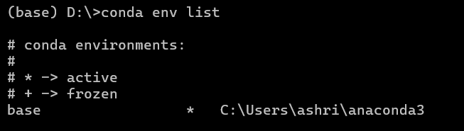
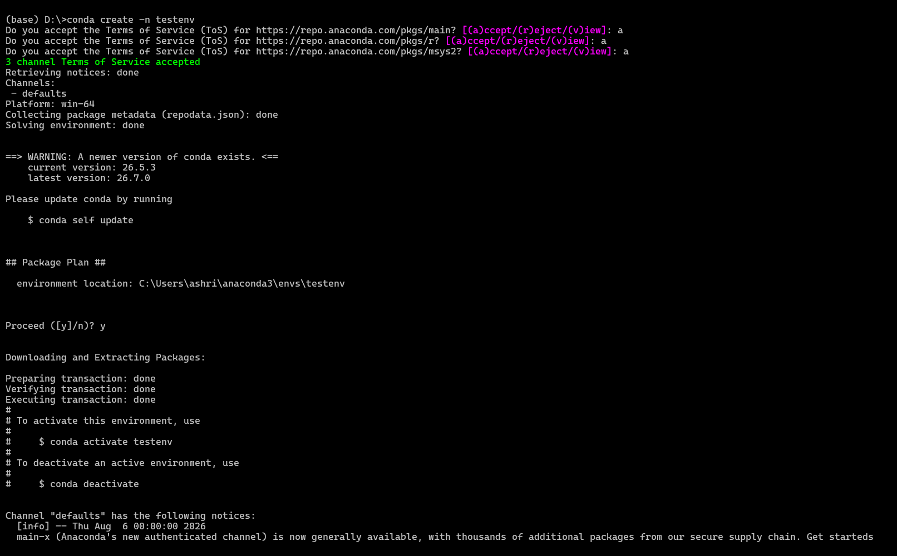
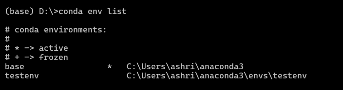
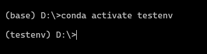
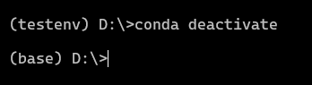
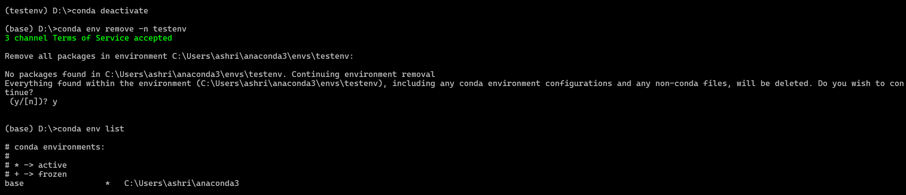

# conda compiler commond

## 1. to activate the conde

```bash
conda activate
```

## 2. To check the version

```bash
conda version
```

## 3. To check package available in conda (list)

```bash
conda list
```

## 4. To check the env list

```bash
conda env list
```



## 5. To create the new env

```bash
conda create -n <env_name>
```




### 5.1 To activate the env

```bash
conda activate <env_name>
```



### 5.2 To deactivate the env

```bash
conda deactivate
```



### 5.3 To remove the env

```bash
conda env remove -n <env_name>
```


## 6. To download any package
```bash
    conda install <package_name>
    conda install jupyter
```
