# Introduction of `Numpy`
* Numpy - `Numerical python`
* It is called as `N-dimensional` array
* It is faster in comparison to python `list`
* It is written in `C` language which is very close to machine since it is low level language.

# Python list vs Numpy
1. Execution Time is faster as it is written in `C` language
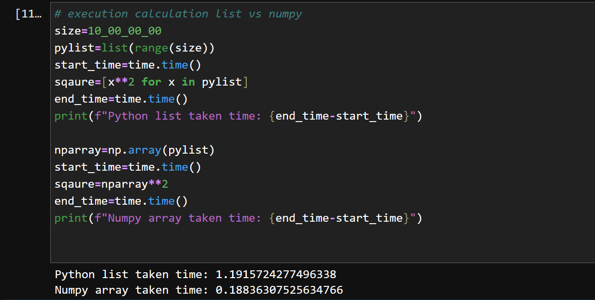
2. Memory taken by list is more than numpy because list are hetrogenous as well then contain the metadata whereas the numpy is homogenous
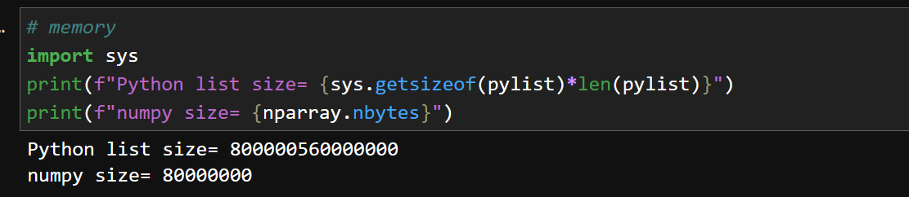

# 3. Different way to create the `Numpy`
## 3.1: zeros Numpy
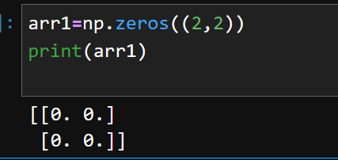

we can declare the data types as well in this
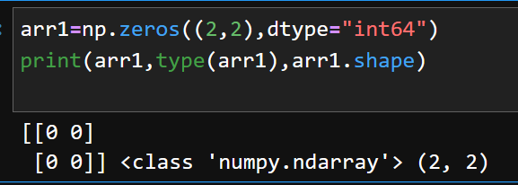

## 3.2: Ones numpy
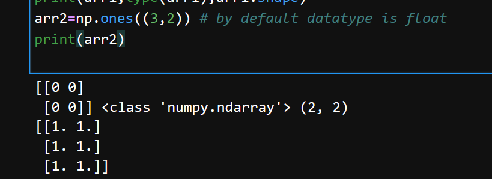

## 3.3: 1-D
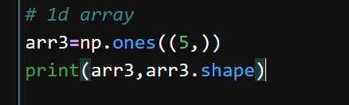

## 3.4: prefilling with some value
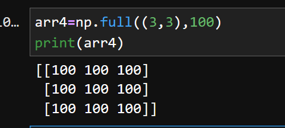

## 3.5 Indentity matrix
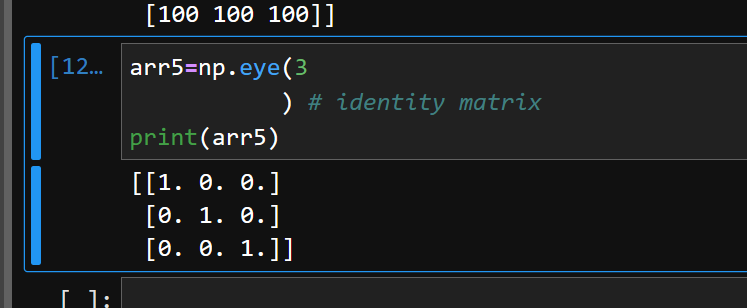

## 3.5 similiar to `range` np have `arange`
## 3.6 `linspace`
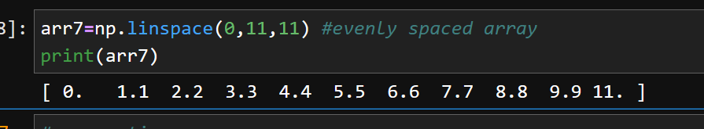
# 4. Properties
## 4.1 `shape` - tells the dimension of the array
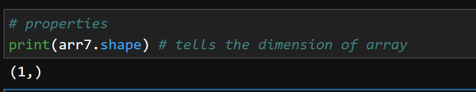

## 4.2 `size` - tells the total number of element presnet
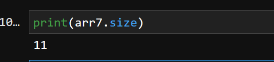

## 4.3 `dtype`- tells the datatype of array element
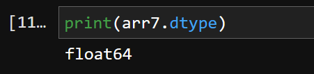

## 4.4 `ndim`- tells the dimesntion of array
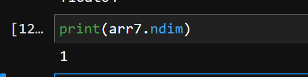

## 4.5 `astype` - for array conversion into different data type

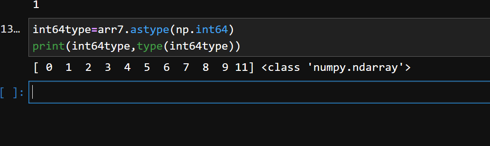

# 5. Operations
## 5.1: `reshape` changes the dimension of array
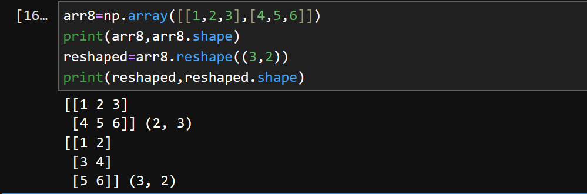

## 5.2: `flatten` it change the array into 1d
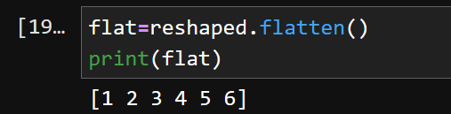

## 5.3: Indexing
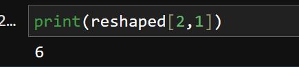

## 5.4: fancy indexing
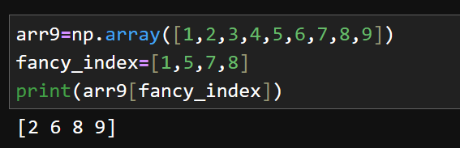
